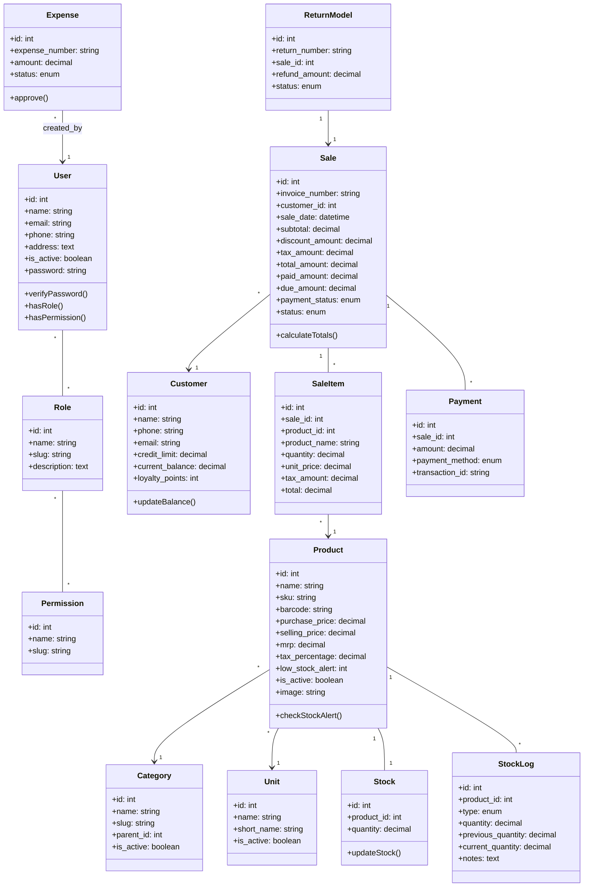
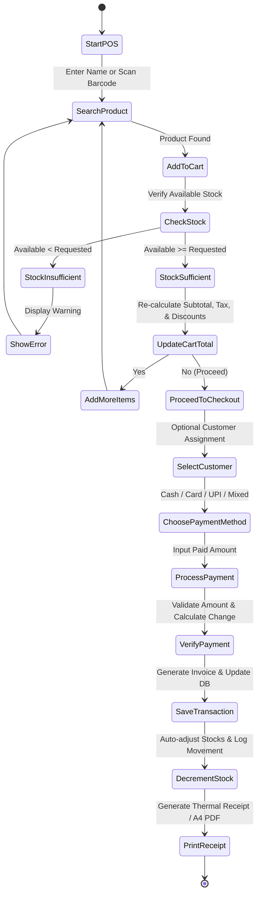
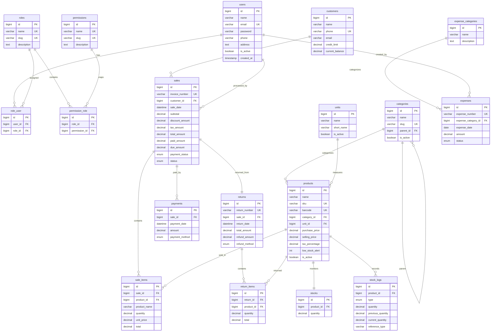

# Software Requirements Specification (SRS)

## MrCherry Computers POS System

### Group Project (TICT3123) - 2026

---

**Department of Information and Communication Technology**  
**Faculty of Technology**  
**University of Ruhuna**  

**Title of the Project:** MrCherry Computers Point-of-Sale (POS) & Inventory System  
**Document:** Software Requirements Specification  
**Group ID:** FOT-ICT-2026-GP12  

**Submitted by:**  
1. TG/2022/1001 – K. P. A. N. Siriwardena  
2. TG/2022/1002 – A. B. C. Perera  
3. TG/2022/1003 – M. N. O. Silva  

**Submitted to:**  
(Supervisor’s signature)  
…………………………..  
Dr. T. D. Gamage  
Department of Information and Communication Technology  

**Date of Submission:** July 4, 2026  

---

## Table of Contents

* **Revision History**
* **1. Introduction**
  * 1.1 Purpose
  * 1.2 Document Conventions
  * 1.3 Intended Audience and Reading Suggestions
  * 1.4 Product Scope
  * 1.5 References
* **2. Overall Description**
  * 2.1 Product Perspective
  * 2.2 Product Functions
  * 2.3 User Classes and Characteristics
  * 2.4 Operating Environment
  * 2.5 Design and Implementation Constraints
  * 2.6 Project Documentation
  * 2.7 User Documentation
  * 2.8 Assumptions and Dependencies
* **3. External Interface Requirements**
  * 3.1 User Interfaces
  * 3.2 Hardware Interfaces
  * 3.3 Software Interfaces
  * 3.4 Communications Interfaces
* **4. System Features**
  * 4.1 System Feature 1: User Authentication and Profile Management
  * 4.2 System Feature 2: Product and Inventory Management
  * 4.3 System Feature 3: POS Sales and Invoice Generation
  * 4.4 System Feature 4: Return and Refund Management
  * 4.5 System Feature 5: Expense Management and Approval
  * 4.6 System Feature 6: Business Reporting and Analytics
* **5. Other Nonfunctional Requirements**
  * 5.1 Performance Requirements
  * 5.2 Safety Requirements
  * 5.3 Security Requirements
  * 5.4 Software Quality Attributes
  * 5.5 Business Rules
* **6. Other Requirements**
* **Appendix A: Glossary**
* **Appendix B: Analysis Models**
* **Appendix C: To Be Determined List**

---

## Revision History

**Table 1.1: Document Revision History**

| Name | Date | Reason For Changes | Version |
| --- | --- | --- | --- |
| Group 12 | May 12, 2026 | Initial draft containing core modules. | 0.1.0 |
| Group 12 | June 20, 2026 | Completed database mappings and RBAC specifications. | 0.8.0 |
| Group 12 | July 04, 2026 | Finalized Mermaid diagrams, NFRs, and formatted Cover Page. | 1.0.0 |

---

## 1. Introduction

### 1.1 Purpose
This Software Requirements Specification (SRS) document details the functional and non-functional requirements for the **MrCherry Computers POS System** (Version 1.0.0). The system is a web-based, single-shop point-of-sale, stock control, customer relationship, expense tracking, product returns, and financial reporting platform designed to replace legacy manual billing systems. This document provides a shared reference for software developers, testers, project managers, and supervisors, ensuring alignment with the project goals.

### 1.2 Document Conventions
This document is prepared following the **IEEE Std 830-1998** guidelines. The styling conventions applied include:
* **Font Family:** Times New Roman (body text formatted to 12 pt, 1.5 line spacing).
* **Headings:** Bold hierarchy with default template spacing.
* **Emphasis:** Standard formatting for database tables, keys, and specific code symbols.
* **Requirement Priority:** Detailed functional requirements inherit the priority level of their parent feature areas. Every requirement uses a unique tracking ID (e.g., `FR-POS-01`).

### 1.3 Intended Audience and Reading Suggestions
The primary readers of this document are:
* **Academic Supervisors/Examiners:** Focus on structural alignment (Chapters 1-6) and analysis models (Appendix B).
* **Software Developers:** Prioritize System Features (Chapter 4), External Interfaces (Chapter 3), and Database Mappings (Appendix B).
* **System Testers:** Focus on detailed requirement IDs in Chapter 4 and Non-Functional Attributes (Chapter 5) to draft test cases.
* **End Users (Managers/Cashiers):** Focus on overall functions (Section 2.2) and operational limitations (Section 5.5).

### 1.4 Product Scope
The MrCherry Computers POS System is a localized business platform designed to centralize and automate retail processes. The system provides real-time control over:
* Role-based user authentication (Admin, Manager, Cashier).
* Category, unit, and product data entry with automated barcode/SKU integration.
* Dynamic POS cashier screen containing product search, cart operations, custom discounts, and dual payment support.
* Print document rendering (A4 PDF & thermal receipts).
* Returns processing with automatic stock levels recalculation.
* Operating expense logging and multi-level approvals.
* Interactive analytics reports (daily/monthly sales, stock movement tracking, and net profit-loss calculation).

### 1.5 References
1. *Laravel 11.x MVC Framework Documentation:* https://laravel.com/docs/11.x
2. *MySQL 8.0 Reference Manual:* https://dev.mysql.com/doc/refman/8.0/en/
3. *Spatie Laravel Permission Package v6:* https://spatie.be/docs/laravel-permission/v6/
4. *IEEE Std 830-1998 IEEE Recommended Practice for Software Requirements Specifications.*

---

## 2. Overall Description

### 2.1 Product Perspective
The system is built as a self-contained, client-server web application utilizing the Laravel framework and a relational MySQL database. It integrates with peripheral point-of-sale hardware (barcode readers, A4 printers, thermal slip printers) through the browser.

```
+-------------------------------------------------------------+
|                      Presentation Tier                      |
| (Web Browser: Blade Templates, Alpine.js, Tailwind CSS, JS)  |
+------------------------------+------------------------------+
                               | HTTPS / HTTP
                               ▼
+-------------------------------------------------------------+
|                      Application Tier                       |
| (Laravel 11 Controllers, Services, Spatie Middleware, Auth) |
+------------------------------+------------------------------+
                               | Eloquent ORM
                               ▼
+-------------------------------------------------------------+
|                          Data Tier                          |
|                     (MySQL 8.0 Database)                    |
+-------------------------------------------------------------+
```
**Figure 2.1: Three-Tier System Architecture**

### 2.2 Product Functions
The main functions of the system are grouped as follows:

* **Authentication & Authorization:** Secure login/logout, password reset, and role-based access control (RBAC).
* **Master Data Setup:** Cataloging of inventory items, measurement units, and product categories.
* **Core POS Transaction Engine:** Real-time search of products, transaction holding, tax calculation, discount limits, and payment processing.
* **Inventory Control:** Automatic stock deduction, manual audit trail logging, and low-stock notification triggers.
* **Finance & Accounting:** Logging business expenses, categorization, and tracking approval workflows.
* **Returns & Adjustments:** Generating refund entries and restoring stock values.
* **Business Intelligence:** Interactive sales summaries, performance charts, and downloadable PDF reports.

### 2.3 User Classes and Characteristics
The system supports three user classes:

**Table 2.1: User Class Profiles**
| User Class | Frequency of Use | Privilege Level | Technical Expertise | Primary Goal |
| --- | --- | --- | --- | --- |
| **Admin** | Occasional / Daily | Superuser (Full access) | Moderate | Manage user accounts, override policies, approve expenses, audit database logs. |
| **Manager** | Daily | Intermediate (Operational) | Moderate | Add products, manage stock levels, monitor sales performance, view financial reports. |
| **Cashier** | Constant (Shift-based) | Low (Transactional) | Basic | Fast cart checkout, register new customers, reprint cashier receipt slips. |

### 2.4 Operating Environment
* **Server Infrastructure:** Host running PHP 8.2+, MySQL 8.0+, web server (Apache/Nginx), and composer environment.
* **Client Interface:** Modern web browser (Chrome 110+, Edge 110+, Firefox 115+) running on desktop, laptop, or tablet.
* **Network Requirements:** High-speed local network (LAN) or cloud-hosted web connection using standard port 80/443.

### 2.5 Design and Implementation Constraints
* **Framework Constraint:** Must be written in Laravel 11.x to utilize standard MVC routing and Eloquent ORM.
* **Database Constraint:** Relational MySQL schema with strict foreign key constraints (`ON DELETE RESTRICT` for products with sale histories).
* **Security Constraint:** Passwords must be hashed using the `bcrypt` algorithm. CSRF tokens must protect all POST/PUT requests.
* **Hardware Constraint:** The POS screen must render quickly and perform without delay on dual-core terminals with 4GB RAM.

### 2.6 Project Documentation
The project deliverables include:
* Completed source code directory.
* Relational database migration scripts and role/user seeding configurations.
* Detailed developer workflow guides and RBAC routing references.
* System test plan and walkthrough execution logs.

### 2.7 User Documentation
The end-user documentation includes:
* **System Operations Manual:** Step-by-step cashier walkthrough for the checkout interface.
* **Quick Reference Guide:** Configuration sheets for default logins and troubleshooting steps.
* **Online Help Tooltips:** In-app interface explanations for stock adjustments and expense categories.

### 2.8 Assumptions and Dependencies
* **Local Printing:** Assumes standard browser print capabilities exist on the client computer to interface with the operating system's printer spooler.
* **Data Integrity:** Assumes store staff record stock inputs accurately, and do not manually tamper with database tables.
* **Continuous Power:** The checkout counter must be connected to an Uninterruptible Power Supply (UPS) to avoid database corruption during sudden power failures.

---

## 3. External Interface Requirements

### 3.1 User Interfaces
The system provides a responsive, professional dashboard styling built with Tailwind CSS. Key layout requirements include:
* **Consistent Navigation:** A fixed sidebar displaying modules according to user role permissions.
* **Cashier Screen (POS):** A unified layout containing a product search bar, a line-item cart, customer selection, dynamic pricing indicators, and payment buttons.
* **Validation Messaging:** Field-specific warning dialogs for invalid values (e.g., negative input or out-of-stock items).
* **Responsive Breakpoints:** Columns collapse into stacked formats on tablets and small screens.

### 3.2 Hardware Interfaces
The application supports standard POS hardware interfaces via driverless emulation:
* **Barcode Scanner:** Scans barcode strings and inserts them into the focus input field as keyboard emulation input.
* **Thermal Receipt Printer:** Standard ESC/POS-compatible 80mm/58mm thermal printers running via browser print styling.
* **A4 Standard Office Printer:** Used for printing full-size management invoices and PDF reports.

### 3.3 Software Interfaces
The application interfaces with:
* **MySQL Database Engine:** Using PDO connections configured in `.env`.
* **DomPDF Engine:** Converts HTML Blade designs into downloadable A4 PDF documents.
* **Laravel Excel (PhpSpreadsheet):** Exports tabular report arrays into Excel format.
* **SMTP Mail Server:** Relays password reset notifications via standard mail protocols.

### 3.4 Communications Interfaces
* **Transport Protocols:** Handled via HTTP/1.1 and secured with HTTPS TLS 1.3 protocol.
* **Asynchronous Updates:** Client-server communication utilizing Livewire and Alpine.js to update cart quantities and search results dynamically without full page reloads.

---

## 4. System Features

### Use Case Diagram

```mermaid
graph TD
    subgraph Actors
        A[Admin]
        M[Manager]
        C[Cashier]
    end
    
    subgraph MrCherry Computer POS System
        UC1(Login & Profile Management)
        UC2(Manage Users & Roles)
        UC3(Manage Categories & Units)
        UC4(Manage Products & Images)
        UC5(Update Stock & Adjustments)
        UC6(Access POS & Search Products)
        UC7(Process Payments & Invoice)
        UC8(Reprint & Download Invoices)
        UC9(Manage Customers & Credit)
        UC10(Process Returns & Refunds)
        UC11(Record & Track Expenses)
        UC12(Approve Expenses)
        UC13(View Business Reports & PnL)
    end
    
    C --> UC1
    C --> UC6
    C --> UC7
    C --> UC8
    C --> UC9
    
    M --> UC1
    M --> UC3
    M --> UC4
    M --> UC5
    M --> UC6
    M --> UC7
    M --> UC8
    M --> UC9
    M --> UC10
    M --> UC11
    M --> UC13
    
    A --> UC1
    A --> UC2
    A --> UC3
    A --> UC4
    A --> UC5
    A --> UC6
    A --> UC7
    A --> UC8
    A --> UC9
    A --> UC10
    A --> UC11
    A --> UC12
    A --> UC13
```


**Figure 4.1: High-Level System Use Case Diagram**

---

### Initial Class Diagram


**Figure 4.2: Domain Entity Class Diagram**

---

### Checkout Activity Diagram


**Figure 4.3: Checkout Workflow Activity Diagram**

---

### 4.1 System Feature 1: User Authentication and Profile Management

#### 4.1.1 Description
Ensures that only registered employees can access system routes. Features include secure login redirection, password encryption, and customizable profile settings.

#### 4.1.2 Use Case Scenario

**Table 4.2: Use Case Scenario - User Authentication**
| Use Case Element | Details |
| --- | --- |
| **Actor** | Admin, Manager, Cashier |
| **Pre-conditions** | The user has a registered email in the database and is marked active. |
| **Basic Flow** | 1. User navigates to `/login`. <br> 2. User inputs their email and password, then submits. <br> 3. System checks database credentials. <br> 4. System starts session and redirects user to their role-based dashboard. |
| **Alternative Flow** | If email or password is invalid, the system displays an error message and redirects back to the login page. |
| **Post-conditions** | User receives a secure session token and accesses the layout navigation menu. |

#### 4.1.3 Detailed Functional Requirements
* **FR-AUTH-01:** The system shall restrict all database query routes to authenticated users, except login pages.
* **FR-AUTH-02:** The system shall encrypt passwords using `bcrypt` before database storage.
* **FR-AUTH-03:** The system shall auto-redirect logged-in users to the dashboard.
* **FR-AUTH-04:** The system shall allow users to edit their own phone number, address, and password.

---

### 4.2 System Feature 2: Product and Inventory Management

#### 4.2.1 Description
Allows managers to create product items, link them to specific categories and units, adjust stock levels manually, and set thresholds for low stock notifications.

#### 4.2.2 Use Case Scenario

**Table 4.3: Use Case Scenario - Manage Products**
| Use Case Element | Details |
| --- | --- |
| **Actor** | Admin, Manager |
| **Pre-conditions** | Product categories and measurement units are created and active. |
| **Basic Flow** | 1. User clicks "Add Product". <br> 2. User enters name, SKU, barcode, purchase price, selling price, and low stock threshold. <br> 3. User uploads product image and selects category/unit. <br> 4. System validates inputs and updates the database. |
| **Alternative Flow** | If the SKU or barcode is duplicate, the system displays an error and prompts for a unique code. |
| **Post-conditions** | Product record is created with an initial stock level of zero. |

#### 4.2.3 Detailed Functional Requirements
* **FR-PROD-01:** The system shall allow Admins and Managers to perform CRUD operations on categories, units, and products.
* **FR-PROD-02:** The system shall auto-generate url slugs from category and product names.
* **FR-PROD-03:** The system shall log every manual stock change (type: `in`, `out`, `adjustment`, `return`) in the `stock_logs` table.
* **FR-PROD-04:** The system shall display a low-stock alert when quantity drops below the alert threshold.

---

### 4.3 System Feature 3: POS Sales and Invoice Generation

#### 4.3.1 Description
Provides cashiers with a fast checkout interface to search products by barcode or name, manage a cart, apply discounts, select customers, process payments, and print invoices.

#### 4.3.2 Use Case Scenario

**Table 4.4: Use Case Scenario - POS Sales Checkout**
| Use Case Element | Details |
| --- | --- |
| **Actor** | Admin, Manager, Cashier |
| **Pre-conditions** | Cashier is logged in, products are in stock, and POS interface is active. |
| **Basic Flow** | 1. Cashier scans barcode or searches product name. <br> 2. Product is added to the cart; the system verifies stock availability. <br> 3. Cashier applies discounts and selects customer (if applicable). <br> 4. Cashier chooses payment method and submits transaction. <br> 5. System generates invoice, saves record, deducts stock, and displays receipt. |
| **Alternative Flow** | If the cart item quantity exceeds available stock, checkout is blocked and the system shows an error message. |
| **Post-conditions** | The transaction status is marked `completed` and the database updates. |

#### 4.3.3 Detailed Functional Requirements
* **FR-POS-01:** The system shall provide an autocomplete search interface for products.
* **FR-POS-02:** The system shall apply fixed or percentage discounts, capped based on cashier role limits.
* **FR-POS-03:** The system shall generate a unique invoice matching the format `INV-YYYYMMDD-00001`.
* **FR-POS-04:** The system shall support printing thermal invoice slips (80mm) and downloading A4 PDF bills.

---

### 4.4 System Feature 4: Return and Refund Management

#### 4.4.1 Description
Enables handling product returns. The system retrieves original invoice records, verifies quantities, calculates refund amounts, and restores returned products to stock.

#### 4.4.2 Use Case Scenario

**Table 4.5: Use Case Scenario - Process Product Return**
| Use Case Element | Details |
| --- | --- |
| **Actor** | Admin, Manager |
| **Pre-conditions** | The sale transaction is completed and the invoice number is valid. |
| **Basic Flow** | 1. User searches the invoice number to load sold items. <br> 2. User selects return quantities and enters the reason. <br> 3. User submits return request. <br> 4. System updates database, marks return status, and increases stock levels. |
| **Alternative Flow** | If return quantity exceeds original sale quantity, the system blocks the return. |
| **Post-conditions** | A return ID is created and corresponding stock log entries are logged. |

#### 4.4.3 Detailed Functional Requirements
* **FR-RET-01:** The system shall block returns containing quantities higher than those sold.
* **FR-RET-02:** The system shall auto-restore product stock values on completion of return requests.
* **FR-RET-03:** The system shall store return transaction records under a unique index matching `RET-YYYYMMDD-00001`.

---

### 4.5 System Feature 5: Expense Management and Approval

#### 4.5.1 Description
Enables logging operating costs, uploading receipt images, and routes them to admins for authorization.

#### 4.5.2 Use Case Scenario

**Table 4.6: Use Case Scenario - Manage Business Expense**
| Use Case Element | Details |
| --- | --- |
| **Actor** | Creator (Manager), Approver (Admin) |
| **Pre-conditions** | Expense categories are created and active. |
| **Basic Flow** | 1. Creator enters expense amount, category, date, and description. <br> 2. Creator uploads receipt image and submits. <br> 3. Admin reviews pending expenses and clicks "Approve". <br> 4. System marks status as `approved` and includes the amount in calculations. |
| **Alternative Flow** | If Admin rejects the expense, the status updates to `rejected` and is excluded from profit-loss reports. |
| **Post-conditions** | Expense logs update and the status is locked. |

#### 4.5.3 Detailed Functional Requirements
* **FR-EXP-01:** The system shall support receipt file uploads, restricted to PDF, JPEG, and PNG formats.
* **FR-EXP-02:** The system shall auto-approve expenses created by Admin users.
* **FR-EXP-03:** The system shall block modification of expenses once approved or rejected.

---

### 4.6 System Feature 6: Business Reporting and Analytics

#### 4.6.1 Description
Provides graphical and tabular reports showing store performance metrics.

#### 4.6.2 Detailed Functional Requirements
* **FR-REP-01:** The system shall generate daily, monthly, and yearly sales reports with profit margins.
* **FR-REP-02:** The system shall generate stock movement reports showing logs for audit verification.
* **FR-REP-03:** The system shall calculate profit/loss totals by subtracting expenses from net sales.
* **FR-REP-04:** The system shall support date range filters and export reports in PDF and Excel formats.

---

## 5. Other Nonfunctional Requirements

### 5.1 Performance Requirements
* **Response Time:** Product search queries and POS autocomplete inputs must return database matches in less than 500 milliseconds.
* **Report Load Time:** Financial tables and charts must calculate and display within 3 seconds for datasets under 100,000 transaction rows.
* **Concurrency:** The system must support at least 15 concurrent cashier sessions without showing performance degradation.

### 5.2 Safety Requirements
* **Database Transact-SQL Integrity:** POS payment routines must run inside SQL transactions. If a step fails, the system rolls back all updates to keep stocks and payments consistent.
* **Data Loss Prevention:** The system must run automated daily backups of the database schema and store logs on a separate storage drive.

### 5.3 Security Requirements
* **URL Protection:** The system must prevent access to restricted pages via direct URL entry by returning a `403 Forbidden` response.
* **File Upload Filters:** Image uploads must be validated to prevent executable script execution on the server.
* **SQL Injection & XSS Protections:** The system must secure variables using Eloquent bindings and sanitize HTML fields before output rendering.

### 5.4 Software Quality Attributes
* **Maintainability:** The code must follow the standard Laravel Model-View-Controller pattern, separating business logic from design templates.
* **Adaptability:** Configuration settings must be stored in `.env` variables to allow easy migration between development and production environments.
* **Usability:** The interface must use clear labels, tooltips, and keyboard shortcuts to allow efficient operation by cashier staff.

### 5.5 Business Rules
* **No Negative Stock Sales:** The system must block checkout operations if the cart quantity exceeds the available product stock.
* **Discount Capping:** Cashiers are restricted to applying maximum discounts of 10% per item and 5% per transaction. Larger discounts require Manager override.
* **Audit Trail Security:** System logs and transactional records cannot be modified or deleted, maintaining a complete record of store operations.

---

## 6. Other Requirements

### 6.1 Database Backup and Recovery
* The system configuration must include daily SQL dumps scheduled via server cron jobs.
* Backup files must be compressed and saved to a secure directory outside the webroot.

### 6.2 Internationalization and Localization
* The default currency is set to Sri Lankan Rupees (LKR).
* Numerical fields must use standard digit formatting and represent dates in YYYY-MM-DD format.

---

## Appendix A: Glossary

* **API (Application Programming Interface):** Intermediary software rules defining how system components interact.
* **Breeze:** A simple Laravel authentication scaffolding package.
* **CRUD (Create, Read, Update, Delete):** Standard database data manipulation actions.
* **ESC/POS:** A standard printer command language system developed by Epson.
* **Low Stock Alert:** An automated indicator triggered when inventory falls below a specified quantity threshold.
* **Spatie Permission:** A Laravel security package that enables role-based user access controls.
* **UPI (Unified Payments Interface):** A real-time mobile payment protocol.

---

## Appendix B: Analysis Models

### Entity-Relationship Diagram (ERD)


**Figure B.1: System Database Entity-Relationship Diagram**

---

## Appendix C: To Be Determined List

1. **TBD-01:** Card terminal API and local bank payment gateway integration protocols.
2. **TBD-02:** Automated SMS client configuration for sending billing summaries and loyalty point logs.
3. **TBD-03:** Multi-branch central database synchronization schemas and cache parameters.
